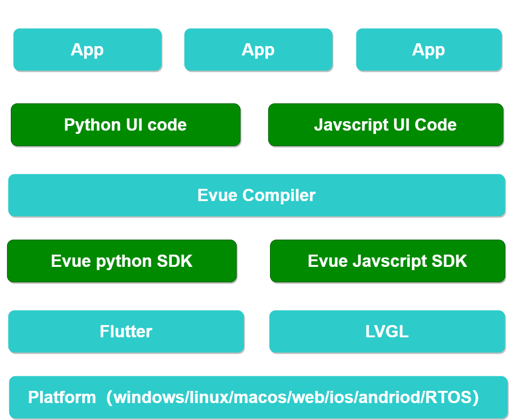
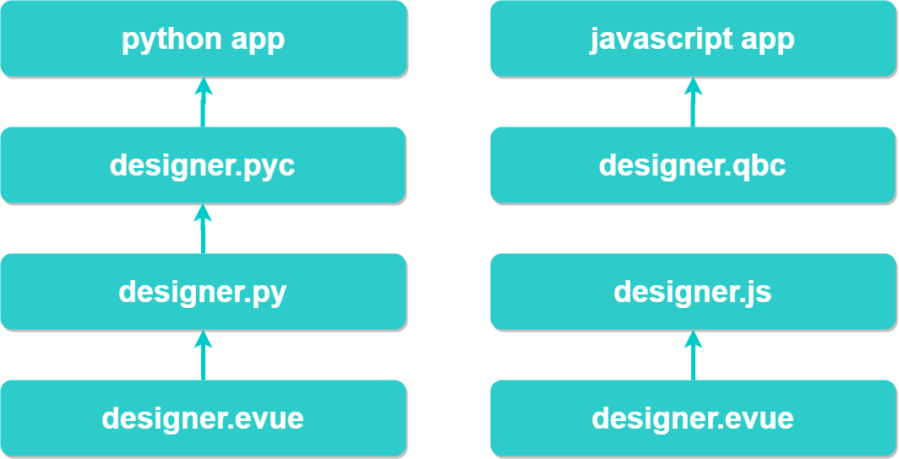
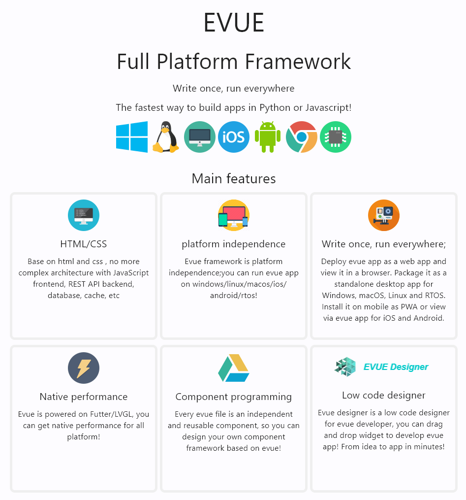
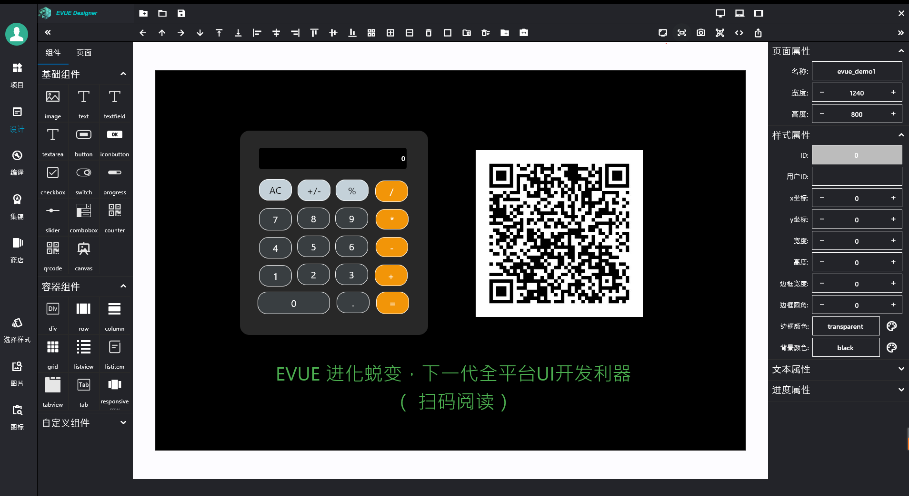

# evue

> Evue是一个高性能的跨平台应用开发框架，可以运行在windows/linux/macos/web/ios/andriod/rtos多种平台，一次开发，多端运行!

 查看 [English](https://github.com/scriptiot/evue/blob/master/README.md) 英文说明.

 阅读 [《EVUE 进化蜕变，下一代全平台UI开发利器》](https://www.yuque.com/dragondjf/ltn95z/krmcxd?singleDoc)了解更多介绍

## 框架

+ Evue 架构

> Evue 是一个基于html/css的高性能的gui应用框架，与平台和ui引擎无关




+ Evuecompiler 编译器架构

> evue编译器的功能主要是将evue文件编译为python/javascript代码；




## 特性




## 安装
使用 [pip](https://github.com/scriptiot/evue)安装evue.

```bash
pip install evue
```

or
```bash
git clone https://github.com/scriptiot/evue.git
cd evue
python setup.py install # also `pip install ."
```

## 快速开始

+ [evue_website](https://github.com/scriptiot/evue/tree/master/examples/evue_website)

```python
cd examples
python evuebroswer.py ./evue_website/project.json
or
python evuebroswer.py ./evue_website/app.py
```


+ [evue_login](https://github.com/scriptiot/evue/tree/master/examples/evue_login)

```python
cd examples
python evuebroswer.py ./evue_login/project.json
or
python evuebroswer.py ./evue_login/app.py
```


## Evue Studio

> Evue Studio 是一个服务开发者快速创建/编译/发布基于evue的应用的开发者平台。



## 社区讨论

+ [Discussions](https://github.com/scriptiot/evue/discussions)
+ [Issues](https://github.com/scriptiot/evue/issues)


## 社区达人招募

+ `无论您是社区技术达人、设计师、产品经理、运营者，欢迎为evue项目贡献自己的一份力量!`
+ `如果你喜欢，请发送email到【ding465398889@163.com】或者添加微信dragondjf！`

## 联系我们

> 如果需要更多的技术支持或者商务合作, 请发送email/微信/QQ获取更多详细的支持!

+ Email : ding465398889@163.com
+ WeChat: dragondjf
>
+ Evue for IOT
>


## 致敬

+ [evm](https://github.com/scriptiot/evm)
+ [lvgl](https://github.com/lvgl/lvgl)
+ [flet](https://github.com/flet-dev/flet)
+ [flutter](https://github.com/flutter/flutter)
